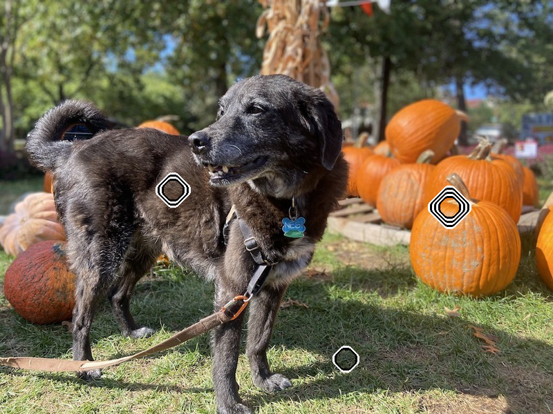
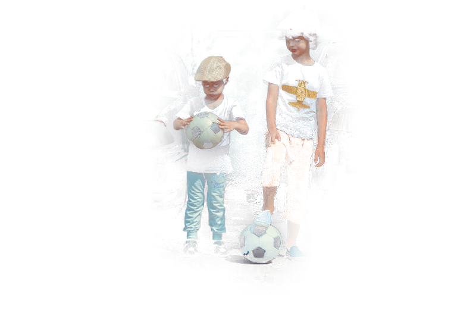

# Hierarchy Generation

This repository is for code for the automatic generation of a hierarchical segmentation of an image, which is my contribution to a research project led by [Ted Chao](https://mason.gmu.edu/~cchao8/) from the [GMU Creativity and Graphics Lab (CraGL)](https://cragl.cs.gmu.edu). The general idea is that superpixels can be clustered to form semantic regions which separate constraints. I worked with the group as part of my [TJHSST senior research](https://tjhsst.fcps.edu/academics/research-program) project during the 2021-2022 school year, but worked with Professor Gingold, the head of [CraGL](https://cragl.cs.gmu.edu), through [ASSIP](https://science.gmu.edu/assip) over the summer of 2021.

# Setup

- Put images of interest in the `input/` directory. Due to limitations in the feature vector generation, the images must be `.png` files.

- Install [anaconda](https://www.anaconda.com/products/individual)/[miniconda](https://docs.conda.io/en/latest/miniconda.html), then create the conda environment for `hierarchy-generation`.

  ```bash
  conda env create -f environment.yml
  ```

- Change directory into the feature generation submodule, and create and activate the conda environment for `sss`. The feature generation code is from the paper [Semantic Soft Segmentation](http://yaksoy.github.io/sss/). Run the `.sh` file in that directory to generate the feature vectors, which are stored as `.mat` files in `features/output/{filename}.mat`.

  ```bash
  cd features
  conda env create -f environment.yml
  conda activate sss
  sh run_extract_feat.sh
  ```

- Change directory back to the root and activate the `hierarchy-generation` conda environment, then run the superpixel-based hierarchy generation code. The CLI takes an input image and failed constraint locations in (row, column) order. See the docstring (`-h` or `--help`) for more info.

  ```bash
  cd ..
  conda activate hierarchy-generation
  python hierarchy_generation.py "input/image.png" -c 250 850 -c 580 360 -c 160 470 -c 400 400
  ```

## Motivation

The image editing algorithm we have developed, _LoCoPalettes_, takes user constraints as input to recolor an image with palette-based image editing. _LoCoPalettes_ relies on a hierarchy of semantic segments in order to allow for edits to increasingly specific regions of the image. The hierarchy is recursive in nature, where each parent node's region is the union of all of the child nodes' regions, so leaf nodes are the smallest and most specific segments, and the root node is the entire image. Note also that the union of all of the nodes in any given level of the tree reconstructs the entire image.

In all of the examples in our submission to SIGGRAPH 2022, we assembled the hierarchy by hand, stitching together and joining segments either from a single run of a neural network-based semantic segmentation algorithm or from manual tracing in Photoshop. However, _LoCoPalettes_ cannot be integrated into any photo editing software until this hierarchy can be generated automatically.

## Story

There are two main approaches to hierarchy generation: A recursive “top-down” approach, where the input is broken it into large semantic segments and then the process is repeated for each segment, and a merging-based “bottom-up” approach, where the input is shattered into many small fragments which are merged together on the way up the hierarchy.

I initially attempted the "top-down" approach, in order to take advantage of the recursive nature of the hierarchy. By paralleling this with a recursive segmentation, I could create a tree while avoiding the need to piece segments together after each segmentation. I began by experimenting with feeding just one segment from the output of a segmentation back in as input. I ran [SETR](https://github.com/open-mmlab/mmsegmentation/blob/master/configs/setr/README.md) on an image, created a unique output image for each identified segment, and then selected one of those and attempted to run SETR on it again. As visible in the images below, the segmentation didn't reveal any more detail. I expected, for example, for the railing to be separated from the wall, since the colors are different, but that didn't happen.

|  |  |
| :-------------------------------: | :-------------------------------: |
|          initial segment          | result of segmentation of segment |

In order to identify these more detailed features, I experimented with isolating the initial segments into contiguous regions before saving them, and then cropping each result of the initial segmentation so that the segment takes up most of the image. I hypothesized that more specific semantic segments will be created if the area of interest took up a larger portion of the input. I also experimented with feeding back the part of the original image withing this bounding box, instead of the part of the segment. As visible in the images below, neither of these approaches really worked. While the segmentation of the cropped original image identified the railing as a distinct segment, other experimentation revealed that it generally doesn't identify any detail beyond that of the initial segmentation.

|   |      |  |
| :---------------------------------: | :--------------------------------: | :--------------------------------: |
| initial segment within bounding box | original image within bounding box |    segmented region of original    |

To continue testing my hypothesis that operating on a view of the original image will create a more detailed semantic segmentation, I attempted the same workflow but with [SenFormer](https://github.com/WalBouss/SenFormer), an ensemble learning-based network, instead of SETR, a transformer-based network. As visible in the images below, SenFormer struggles similarly to extract more detail, even from a cropped region of the original. Based on this experiment, I think that neural network-based image segmentation algorithms are going to be invariant to cropping (in addition to scaling and translation) of the input image, since these transforms are common when augmenting the training data.

|  |  |  |  |
| :-------------------------------: | :-----------------------------: | :----------------------------: | :------------------------------: |
|          cropped segment          |     segmentation of initial     |          cropped view          |       segmentation of view       |

Having determined that neural network-based segmentation cannot perform recursive segmentation, I decided to segment with [superpixels](https://pyimagesearch.com/2014/07/28/a-slic-superpixel-tutorial-using-python/), which don't depend on a neural network. Superpixels oversegment the image, so I compute the similarity between every pair of superpixels using the Wasserstein distance and then combine sufficiently similar superpixels into non-contiguous regions. This worked, but took a long time to compute (around four seconds) and, in a different test case, merged superpixels which were part of different semantic regions that happened to have similar color distributions.

The images below illustrate the iterative merging of the superpixels for different values of delta, the similarity threshold. Delta allows for interpolation between merging none of the superpixels and all of the superpixels. Images with larger delta values have more general regions, each of which are a union of some of the regions in the image with a smaller delta value. Sweeping values for delta creates a merging schedule that we can turn into a hierarchy.

|  |  |  |  |
| :------------------------------: | :------------------------------: | :------------------------------: | :------------------------------: |
|      0.00 is most detailed       |      0.01 is more detailed       |       0.02 is more general       |       0.05 is most general       |

Finding an optimal value for delta without any additional context is actually an extremely difficult problem. Fortunately, I have additional context: constraints. The goal of segmentation with two constraints is to divide the original region into two sub-regions, each of which contain only one constraint. This means that I want to find the largest value of delta for which the constraints are still part of separate regions, which can be found with a simple binary search.

The images below demonstrate the result of this delta optimization process. Here, the user might want to recolor the ground on the bottom while making no changes to the ground on the top of the image. While the segmentation was able to separate the two regions, it also grouped the baseball player's arm together with the ground, since the pixels shared enough colors. It also took a very long time (around 1 minute!) to create the distances matrix.

|  |  |  |  |
| :-------------------------------: | :----------------------------------: | :-------------------------------: | :-----------------------------: |
|          original image           |             superpixels              |          optimized delta          |     merged to show regions      |

In order to address the performance of distance matrix creation, I decided to try merging similar neighboring superpixels before comparing every superpixel to every other one. The first set of comparisons I call "local merging", and the second I call "nonlocal merging". For local merging, I computed each superpixel's neighbors following the same process as [this figure](https://www.researchgate.net/figure/Illustrating-how-to-find-the-spatial-neighbors-of-one-given-superpixel-xi-j-shown-in-a_fig3_303563893), constructed a region adjacency graph, and then merged it based on the connected components of the graph cut by a threshold. While the creation of this matrix is still dependent on the number of superpixels, separating the local and nonlocal merging cut down the runtime of the baseball image from around 1 minute to 10 seconds.

Below are images demonstrating the effect of different local merging thresholds on the same baseball image as the last example. Just as with delta, higher threshold values mean that more superpixels are getting merged together. However, unlike delta, there isn't an obvious way to decide on a threshold, since merging _neighbors_ until the constraints share a region is going to merge too much of the image to be useful for nonlocal merging. Instead, I just picked a value. I initially normalized the local merging distances matrix and then chose `0.01`, but needed to decrease it to `0.001` once I started segmenting with more superpixels. Choosing a value needed to be justified...

|  |  |  |
| :-----------------------: | :----------------------: | :---------------------: |
|     threshold = 0.001     |           0.01           |       0.1 (oops)        |

After generalizing the division process to work with an arbitrary number of constraints, increasing the number of superpixels, and adjusting the local merging threshold accordingly, the superpixels method can successfully segment the image of the man holding the donut used as an example in our first draft of the paper, and also in [this diagram](https://files.slack.com/files-pri/T23RE8G4F-F03E1NY9TT9/sample_workflow-2.png).

In this example, the user wanted to recolor the curtain to be purple without affecting the man. The user placed a constraint to recolor the curtain, but it made a global palette change and affected the man's skin color. The user then placed another couple of constraints on other parts of the image to keep them constant. Since a single palette couldn't reconcile these constraints, the image would be divided into regions as shown in the last image below, with the light beige area being assigned the purple palette and the rest having the original one.

|  |  |  |
| :-----------------------------: | :--------------------------: | :--------------------------: |
|         original image          |     after local merging      |       final assignment       |

While the segmentation worked well in that example, it struggled to separate the regions in a busier image without any aid from semantic features. In the following example, the constraints would ideally separate Nesi, the dog, and the pumpkins from the rest of the image. However, there is enough variation in lighting within the superpixels corresponding to the dog that they are about as distant from each other as they are from the rest of the image, so the segmentation fails to distinguish.

|  |  |  |
| :--------------------------------: | :-----------------------------: | :-----------------------------: |
|           original image           |       after local merging       |    final (failed) assignment    |

While writing this code, I discovered a significant performance bottleneck in the distance matrix computation (fixed in [#9ee0953](https://github.com/Jklein64/hierarchy-generation/commit/9ee0953c5bdef883f76c257f9f03bc897f93146a)), which cut its time by a factor of 10 (!). This alleviated the need for local merging, which was slower anyway due to a bug in the neighbor finding step. I ended up removing the local merging step completely.

In order to integrate semantic information, I used the per-pixel feature vectors output from the ResNet-based class-agnostic semantic segmentation from [Semantic Soft Segmentation](http://yaksoy.github.io/papers/TOG18-sss.pdf). The feature vectors were very high (128) dimensional, so I projected them to lower dimensions using PCA. I chose a number of dimensions such that 95% of the variance was explained. Below is the Nesi image and its feature vectors, projected with PCA to three dimensions so that it could be visualized.

|  |  |  |
| :--------------------------------: | :------------------------------: | :------------------------------: |
|           original image           |        per-pixel features        |      resulting segmentation      |

And it worked!

However, the masks output from this segmentation are quite messy. For example, it would completely miss Nesi's back leg, and would exclude large chunks from some of the pumpkins. In order to fix this, I decided to pass each mask through the [Guided Filter](http://kaiminghe.com/publications/pami12guidedfilter.pdf), which would smooth out the edges based on pixel differences from the original image. I used a very large window size so that the filter would account for the detail lost by superpixels. I tried, struggled with, and eventually abandoned my attempt at applying the guided filter to multiple masks at once in such a way that their sum is exactly 1. The images below show the results of applying each of the guided masks to the original image. While they _look_ like they might add up, the union of these images isn't actually fully opaque.

|  |  |  |  |
| :---------------------------: | :----------------------------: | :----------------------------: | :----------------------------: |
|        original image         |        first constraint        |       second constraint        |        third constraint        |

At the end of the day, we ended up generating the hierarchy from the output of [DETR](https://scontent-iad3-2.xx.fbcdn.net/v/t39.8562-6/101177000_245125840263462_1160672288488554496_n.pdf), a panoptic segmentation framework. Although DETR itself is unable to isolate distinct features of the instances of an image, such as the gold plane logo on the taller boy’s shirt, we found that the increased representativeness of the local palettes generated from the DETR segments generally allowed them to account for targeted edits to those specific features anyway. The process and code documented in this repository was a worthwhile experiment in the overall research process, even if it wasn't the method we ended up using to generate the hierarchy, and there is still promise in a method based on merging superpixels.

_Future work involves experimenting with variations on the distance metric, such as [CIEDE2000 distance](https://en.wikipedia.org/wiki/Color_difference#CIEDE2000), and adapting the program to work with segmentation algorithms that output only classifications such as SETR and then evaluating the differences between integration of those semantic features. Finding a method to ensure every pixel is completely (and not over-) covered after applying a guided filter is also worth exploring, as simply dilating the mask before smoothing allows for opacities to sum to values greater than 1._
